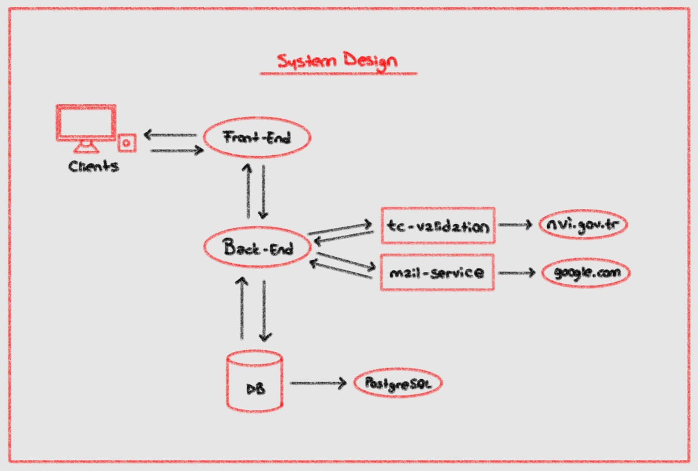
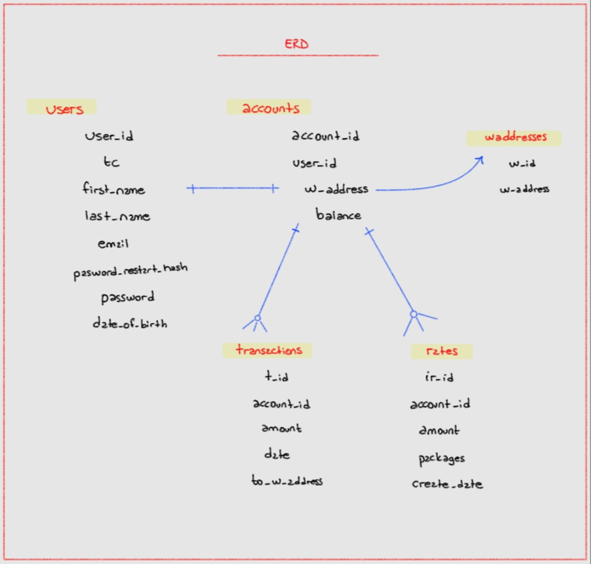
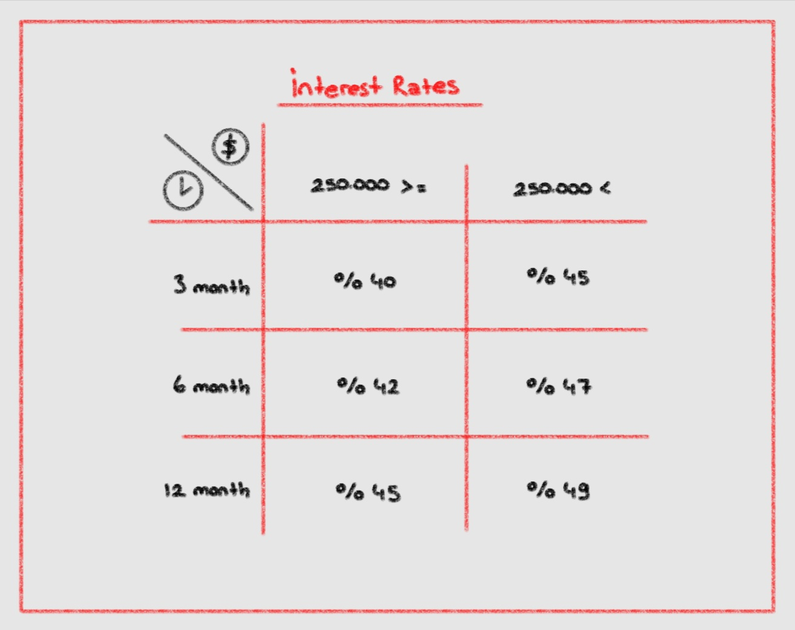

## 👛 `Wallet App`

<br>

<div align="center">

</div>

<br>

- ✅ Basic Wallet App

<br>

<details>
<summary>🧩 System Design</summary>



</details>

<details>
<summary>🔗 ERD</summary>



</details>

<details>
<summary>💲 Interest Rates</summary>



</details>

<br>

Used Technologies in The Project:

[](https://react.dev/)
[](https://www.java.com/en/)
[](https://spring.io/)
[](https://www.postgresql.org/)
[](https://jwt.io/)
[](https://maven.apache.org/)
[](https://square.github.io/okhttp/)
[](https://tckimlik.nvi.gov.tr/Service/KPSPublic.asmx)
[](https://www.java.com/en/)

<br>

### Installation

```bash
git clone https://github.com/Satoshi-Labs/wallet-app.git
```

<br>

### Usage

```bash
docker-compose up
```

<br>

### URL

```bash
http://localhost
```

<br>

<br>

# License

This project is licensed under the MIT License. See the [LICENSE](LICENSE) file for details
